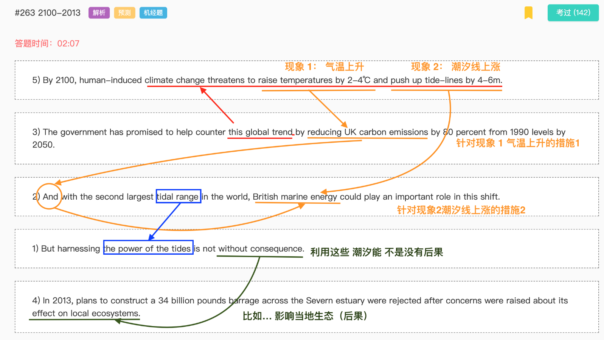
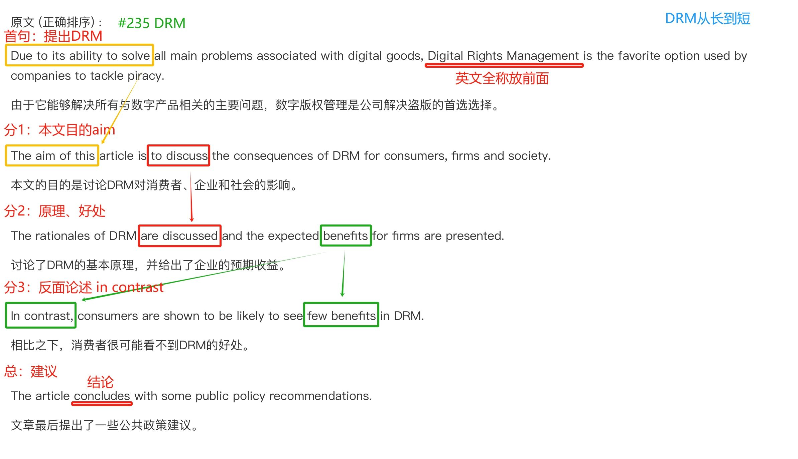

# C哥预测

## FIB_RW

### 词汇

obscure 晦涩  
preferably 最好是  
medicine 医药，医学（涵盖范围广）  
emphasis 名词单数 emphases 名词复数 emphasize 动词原形  
regularly 有规律的  
coin 杜撰，创造新术语  
through 间接通过  
herald 预示预兆  
simultaneously 同时

### 语法

主谓宾是否完整  
the extent to which to引导的定语从句  

### 短语

expenditure of effort 耗费精力  
instant gratification 即时满足  
acquire a taste 对...感兴趣  
array of marine life 各种各样的海洋生物  
the overwhelming factor  
marketing and legal decisions  
other than= except for 除了  
outside factors  
develop people  
enjoy unrivaled progress  
one dollar's worth of income  
address climate change 处理  
production and dissemination of information 传播  
democratizing access to knowledge 大众化  
leapfrogging over the technology gap 跳跃  

### 答案句强记

bind with soil  
for adults recommends  
clones planted outside small towns  
blows in and lingers  
a large and diverse staff  
they became known as stars 注意时态 不可以用are  
determine the true nature 性质是需要确定的  
predict their positions  
use or apply  
clearly and logically  
the plate was developed it was found to be fogged 冲洗胶片 雾蒙蒙的  
international studies have found  
child poverty has been shown  
as mothers enter employment  
what is to be achieved  
people concerned with African development  
the relative shares of  
it is nonetheless a stunning number  
key content 关键内容  
entitle you to discounts 享有

## FIB_L

### 词汇

compatible  
fundamental  
reference  
habitable  
commitment  
permeate  
eliminate  
infrastructure  
coercive  
perception  
convergence  
spectrum  
determining  
minimize  
propose  
expansion  
equities  
corporate  
foreshadowed  
beleaguered  
predicament  
mysterious  
church  
puzzled  
pseudo-Latin  
gleaned  
twenty-six  
irrelevant  

### 短语

salted fish  
how relative  
raw materials  
private insurance  
was exceptionally heavy for
waters of Dal Lake  
militancy attacked  
honed their skills 磨炼技能  

## FIB_R

### 词汇

campus 校区  
therefore 根据已有信息做出推断  
revision 修订  
altogether 总共，全部  
reversal 逆转  
underachievement 成绩不佳  
sited 被认为  
herding 放牧  
curriculum 课程  
taste 兴趣  
terrific 极好的  
whereas 尽管  
tyranny 暴政 （与freedom相对）  
executive 主管  
assembly 集会  
signal 传递信号  

### 短语

distinguishing feature 显著特征  
engage in some bluffing 加入一些虚张声势  
be versed in sth 精通某事物  
clinch the sale 最终达成交易
thanks (in part) to  
build on 以...为基础  
strongly attracted
be forced out of their orbits  
analyze their own process  
management functions 管理职能  
organizational behavior
the nature of organizations
under the bonnet 引擎盖之下  
meet the needs of  
emphasize the need for 强调  
the expenditure of effort 花费，消耗  
look at 研究  
emerge as 变成  
an urban population (与深山老林相对)  
stagnation regins 停滞占支配地位  
in the garden context 在园林环境中  
be meant to have 本应该  
the onslaught of the COVID-19 袭击  
business practice  
make payments 付款  
as interest 作为利息  
key figures 关键人物  
film sets 电影场景  
a series of reforms 一系列改革  
limit the oversupply of credits 指标  

### 答案强记

its own emissions trading program  
representative conservancy committee  
manage funds  
acquire the rights to a sustainable wildlife quota  
center stage for political and social movements  

### 语法

some of the technology involved 后置定语  
solve problems as a computer might  

## RO

### 技巧

确保每一个代词都能清晰有所指  
人名的完整与否
是否有简称  
信息量 the bone shell→ the shell  
看见in addition 不要多想 极有可能不是首句  

#### 科学

现象→代表案例  

#### 人物

从出身开始按照时间线进行  
某人有一个观点→解释观点→

### 错题

柏拉图简介→开创数学学院→尤其是几何学→几何学相关标语  

## WFD二轮
